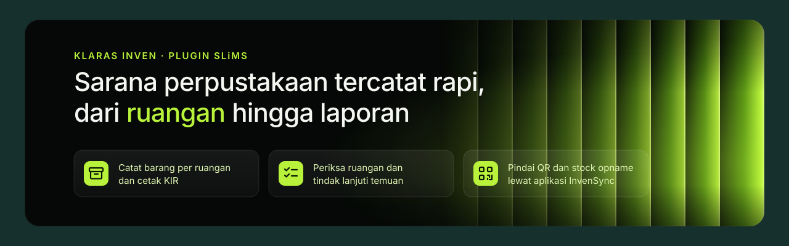

<p align="center">
  
</p>

<p align="center">
  <a href="https://github.com/klarasid/inven/releases/latest"></a>
  
  
</p>

Klaras Inven adalah plugin SLiMS 9 untuk mengelola sarana prasarana perpustakaan. Dengan plugin ini, Anda dapat:

- Mencatat barang per ruangan, lengkap dengan foto, dan mencetak Kartu Inventaris Ruangan (KIR).
- Menjadwalkan pemeriksaan ruangan berdasarkan checklist, lalu menindaklanjuti temuannya hingga diverifikasi.
- Mencetak label barang dengan QR code.
- Mencetak laporan PDF dengan kop institusi Anda.
- Memakai aplikasi HP **Klaras InvenSync** (opsional) untuk pendataan dan stock opname di lapangan.

## Sebelum memulai

Pastikan server Anda memenuhi syarat berikut:

- SLiMS 9 dan PHP 7.4 atau lebih baru.
- Ekstensi PHP `gd`, `mbstring`, `fileinfo`, `curl`, `zip`, dan `SimpleXML`.
- Folder cache SLiMS (`files/cache`) dan folder `images` dapat ditulis oleh PHP.

## Memasang plugin

1. Unduh `klaras-inven-<versi>.zip` dari halaman [Releases](https://github.com/klarasid/inven/releases/latest).
2. Ekstrak ke folder `plugins/` di instalasi SLiMS, sehingga terbentuk `plugins/inventaris-barang`.
3. Masuk sebagai administrator, buka **System → Plugins**, lalu aktifkan **Klaras Inven**.
4. Buka **Stock Take → Ruangan & Barang**.

Paket rilis sudah berisi dependensi PHP dan aset yang telah dibangun, sehingga Anda tidak memerlukan Composer atau Node.js.

> [!NOTE]
> Jika Anda memasang dari kode sumber (bukan paket rilis), jalankan `composer install --no-dev` dari folder plugin.

## Memperbarui plugin

1. Cadangkan database serta folder `images/inventaris-barang`.
2. Ekstrak paket rilis terbaru dan timpa folder `plugins/inventaris-barang`.
3. Buka **System → Plugins** dan jalankan migrasi yang tersedia.

Menu **Perangkat Lunak**, **Gedung & Jaringan**, dan **Pengaturan Cetak** dulu berada di dalam Rekap Sarpras dan Laporan. Migrasi memberikan menu-menu itu kepada grup pengguna yang sudah boleh membuka halaman asalnya; petugas melihatnya setelah masuk ulang. Untuk mengaturnya sendiri, buka **System → User Group**.

Plugin memeriksa rilis baru di GitHub setiap 12 jam. Jika tersedia, pengguna dengan hak tulis melihat pemberitahuan **Versi X tersedia** beserta catatan rilisnya.

> [!IMPORTANT]
> Beberapa migrasi tidak dapat dibatalkan karena menyimpan bukti historis. Selalu cadangkan database sebelum menjalankan migrasi.

## Mengamankan folder foto

Foto barang dan bukti pemeriksaan disimpan di `images/inventaris-barang` dan hanya dapat dibuka melalui panel admin. Plugin membuat `.htaccess` untuk memblokir akses langsung di Apache (memerlukan `AllowOverride`).

Jika Anda memakai Nginx, tambahkan aturan berikut, lalu muat ulang konfigurasinya. Sesuaikan awalan `/opac` dengan path instalasi Anda.

```nginx
location ^~ /opac/images/inventaris-barang/ {
    deny all;
}
```

Untuk memastikan aturan bekerja, buka URL langsung salah satu foto. Server seharusnya menjawab **403 Forbidden**.

Agar lima foto berukuran 2 MB dapat diunggah sekaligus, atur `upload_max_filesize` ke minimal `2M`, `post_max_size` ke minimal `12M`, dan `max_file_uploads` ke minimal `5`.

## Fitur

Semua menu tersedia di modul **Stock Take**, dalam tiga bagian. Pengguna dengan hak baca dapat melihat data dan mencetak PDF; perubahan data memerlukan hak tulis.

**Klaras Inven**: pekerjaan sehari-hari dan ikhtisarnya.

| Menu | Kegunaan |
| --- | --- |
| **Rekap Sarpras** | Melihat kondisi sarana dan prasarana (luas dan fungsi ruang, kondisi barang, perabot, komputer, jaringan, multimedia, lisensi perangkat lunak, keamanan, fasilitas umum, serta pengawasan) dan mencetak rekapnya. Halaman ini hanya ikhtisar; datanya diisi di bagian Data Sarpras. |
| **Tugas** | Mengisi pemeriksaan, melapor kerusakan, mencatat perbaikan, dan memverifikasi hasilnya. Anda juga dapat mengimpor riwayat lama dari Excel. |
| **Jadwal** | Menjadwalkan pemeriksaan ruangan, harian hingga tahunan. Jadwal mengikuti hari libur di **System → Hari Libur**. |
| **Checklist** | Menyusun template checklist pemeriksaan beserta riwayat versinya. |
| **Laporan** | Melihat cakupan dan keterlambatan pemeriksaan, serta mencetak laporan periode atau dokumen pemeriksaan dalam gaya LaTeX, ISO, atau kop institusi. |

**Data Sarpras**: data yang menjadi dasar rekap dan pemeriksaan.

| Menu | Kegunaan |
| --- | --- |
| **Ruangan & Barang** | Mencatat ruangan dan barang, mengunggah hingga 5 foto per barang, membuat kode barang otomatis (misalnya `P01-INV-000001`), dan mencetak KIR. |
| **Perangkat Lunak** | Mencatat aplikasi yang dipakai perpustakaan beserta jenis dan masa berlaku lisensinya. |
| **Gedung & Jaringan** | Mengisi jumlah sivitas akademika, luas gedung, dan bandwidth internet beserta bukti pengukurannya. |

**Pengaturan Inven**

| Menu | Kegunaan |
| --- | --- |
| **Pengaturan Cetak** | Mengelola template kop institusi dan nomor dokumen yang tercetak di PDF. |
| **Aplikasi InvenSync** | Mengizinkan aplikasi HP dan mengelola perangkat yang masuk. |
| **Data pemakaian** | Melihat dan mengatur data pemakaian yang dikirim ke Klaras. |

### Rekap Sarpras

Rekap dihitung dari data yang sudah ada, jadi lengkapi dulu klasifikasinya:

1. Di **Ruangan & Barang**, ubah tiap ruangan dan isi **Luas (m²)** serta **fungsi ruang**. Ada empat fungsi layanan dasar (koleksi, baca, kerja staf, layanan); fungsi lainnya termasuk pendukung.
2. Beri **Kategori** dan **Jenis** pada barang (perabot, peralatan, komputer, multimedia, keamanan, fasilitas umum). Centang beberapa barang di tabel ruangan, lalu klik **Beri kategori** untuk mengisinya sekaligus.
3. Di **Gedung & Jaringan**, isi jumlah sivitas akademika, luas gedung bila diketahui, serta bandwidth beserta bukti pengukurannya.
4. Di **Perangkat Lunak**, catat aplikasi yang dipakai beserta jenis lisensinya.

Setiap aspek menampilkan kondisinya (Sangat baik, Baik, Cukup, Kurang), syarat yang sudah dan belum terpenuhi, rincian datanya, dan saran perbaikan dengan tombol menuju menu tempat datanya diisi. Klik **Cetak rekap** untuk PDF dalam gaya LaTeX, ISO, atau kop institusi.

### Label QR code

Pada halaman ruangan, klik **Cetak label**. Anda dapat memilih ukuran lembar (A4 3×8, A4 2×7, atau stiker 50×30 mm) dan label pertama yang masih kosong. QR code dapat mengarah ke:

- **Halaman publik**: informasi barang yang dapat dibuka tanpa login, tanpa harga dan nama petugas. Tautan ditandatangani sehingga ID barang tidak dapat ditebak.
- **Khusus petugas**: detail barang di panel admin, setelah login.

Cetak dengan skala **100%** agar label tepat pada lembar.

### Kop institusi

Buka **Pengaturan Cetak → Template kop**, lalu unggah PDF kop surat Anda. Halaman 1 menjadi latar halaman pertama laporan; halaman 2 (opsional) menjadi latar halaman berikutnya. Atur area konten dan font isi, lalu klik **Coba cetak** untuk melihat hasilnya.

Jika unggahan ditolak, simpan ulang PDF sebagai **PDF/A** lalu unggah kembali.

Nomor dokumen, revisi, dan tanggal terbit tiap jenis PDF diatur di **Pengaturan Cetak → Nomor dokumen**.

## Aplikasi Klaras InvenSync

Klaras InvenSync adalah aplikasi HP untuk petugas. Dengan aplikasi ini, petugas dapat memotret barang, memindai label QR, mengisi pemeriksaan, melapor kerusakan, dan memindai eksemplar saat stock opname, termasuk saat offline. Semua fitur plugin tetap dapat dipakai tanpa aplikasi.

Untuk mengaktifkan aplikasi:

1. Daftarkan perpustakaan Anda di Klaras Panel dan buat API key.
2. Pasang plugin **SLiMS Connect** (memerlukan PHP 8.1 atau lebih baru), lalu isi API key di **System → SLiMS Connect**. SLiMS harus dapat dibuka melalui HTTPS.
3. Buka **Stock Take → Aplikasi InvenSync**, lalu klik **Izinkan aplikasi**. Langkah ini memerlukan hak tulis System.

Petugas masuk dengan akun SLiMS yang memiliki hak **Stock Take**. Anda dapat mencabut sesi satu perangkat atau mematikan aplikasi sepenuhnya dari halaman yang sama.

## Data pemakaian

Sekali sehari, plugin mengirim ringkasan pemakaian ke Klaras agar plugin gratis ini dapat terus dirawat. Laporan berisi:

- Nama perpustakaan dan alamat SLiMS.
- Versi plugin, SLiMS, PHP, dan database.
- Jumlah ruangan, barang, pemeriksaan, temuan, dan sesi stock opname.
- Frekuensi pemakaian fitur, serta galat teknis yang telah dibersihkan dari isinya.

Plugin **tidak pernah** mengirim isi inventaris, nama atau kode barang, nama ruangan, data anggota, maupun data petugas.

Untuk melihat data persis yang dikirim atau mematikan pengiriman, buka **Stock Take → Data pemakaian**. Saat Anda mematikannya, Klaras menghapus nama dan alamat perpustakaan Anda dari datanya.

## Pemecahan masalah

**PDF gagal dibuat.** Periksa log PHP, pastikan folder `vendor` ada, dan pastikan folder cache SLiMS dapat ditulis.

**Kode PHP tampil saat mencetak.** Buka PDF melalui tombol **Cetak** di plugin. Jangan membuka `plugins/inventaris-barang/print.php` secara langsung.

**Galat `setLogger(...): void`.** Trait PSR Log bawaan SLiMS di `lib/psr-log-aware-trait` belum kompatibel. Tambahkan tipe kembalian `: void` pada `setLogger` di `MpdfPsrLogAwareTrait.php` dan `PsrLogAwareTrait.php`.

**Kolom `filename` tidak ditemukan saat menyimpan barang.** Jalankan semua migrasi di **System → Plugins**.

## Pengembangan

### Menjalankan tes

Tes tanpa database dapat langsung dijalankan dari folder plugin:

```sh
php tests/pdf_template_test.php
php tests/security_controls_test.php
php tests/menu_structure_test.php
node tests/watch_forms_test.cjs
```

Tes integrasi memerlukan database MySQL khusus pengujian. Tes membuat tabel berawalan acak dan menghapusnya setelah selesai.

```sh
export INVENTORY_TEST_DSN='mysql:host=127.0.0.1;dbname=uji'
export INVENTORY_TEST_USER=… INVENTORY_TEST_PASSWORD=…
php tests/watch_integration_test.php
php tests/telemetry_test.php
SLIMS_CONNECT_DIR=/path/ke/slims-connect php tests/invensync_api_test.php
```

### Membuat rilis

Versi plugin tercatat di baris `Version:` pada `inventory.plugin.php`.

```sh
tools/release.sh 2.4.0                # set versi, build frontend, commit, dan tag v2.4.0
git push origin main --follow-tags    # GitHub Actions membangun zip dan menerbitkan rilis
```

Tag berakhiran `-rc.1` atau `-beta.1` diterbitkan sebagai *pre-release* dan tidak ditawarkan sebagai pembaruan.

Untuk mengarahkan laporan data pemakaian ke panel lain saat pengembangan, atur `KLARAS_PANEL_URL`.

## Lisensi pihak ketiga

Plugin ini menyertakan [Alpine.js](https://alpinejs.dev) (MIT), [PDF.js](https://mozilla.github.io/pdf.js/) (Apache-2.0), dan font CMU Serif (SIL Open Font License).
